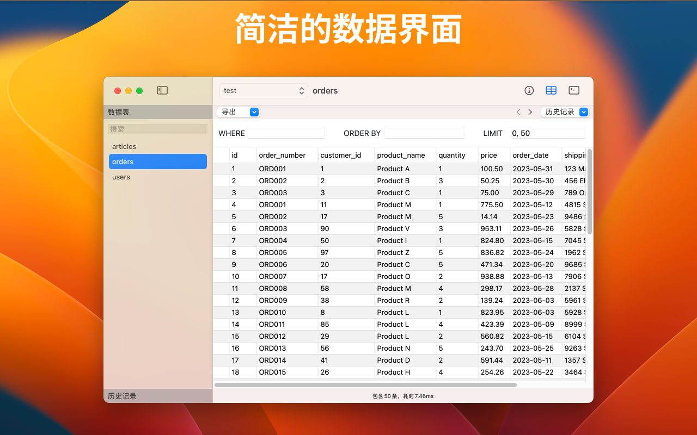
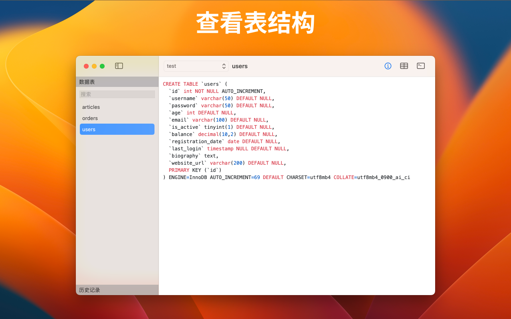

# Sqlman 介绍

Sqlman 是 MacOS 平台一款 MySQL GUI 数据库管理工具。

Sqlman 是新一代的、简洁优雅的 MySQL GUI。专注于快速查询。原生开发，安装包小，响应迅速。

已经上线 App Store。技术是 Swiftui 和 webview 组合。安装包很小，下载大小目前只有 5M 不到。

永久授权目前定价是人民币 68 元，如果喜欢，可以付费支持一下。当前免费用户也是可以使用所用功能的。

App Store 的链接是：[Sqlman Mac App Store](https://apps.apple.com/cn/app/sqlman-mysql-gui-%E6%95%B0%E6%8D%AE%E5%BA%93%E7%AE%A1%E7%90%86%E5%B7%A5%E5%85%B7/id6498632117?mt=12)

如有任何使用上的问题，欢迎在此仓库提出 Issue。当然也欢迎添加微信和我沟通：

### 一些界面的截图

